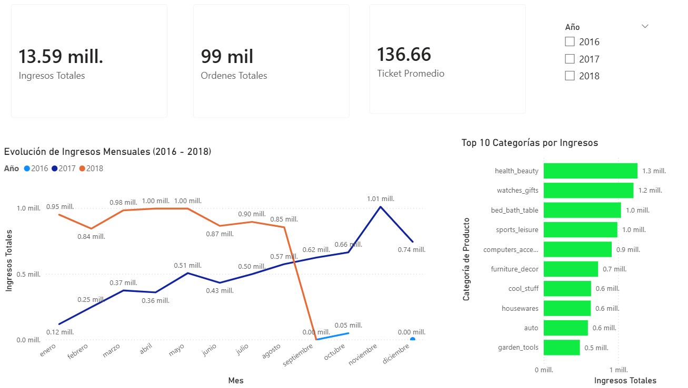
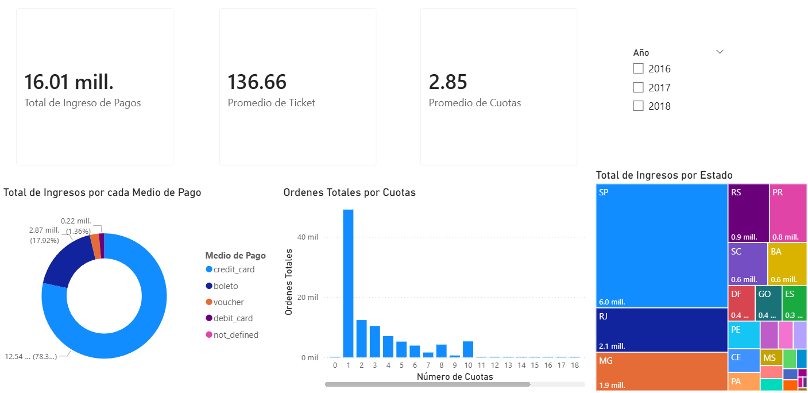
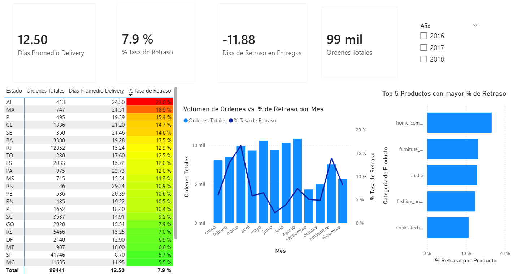
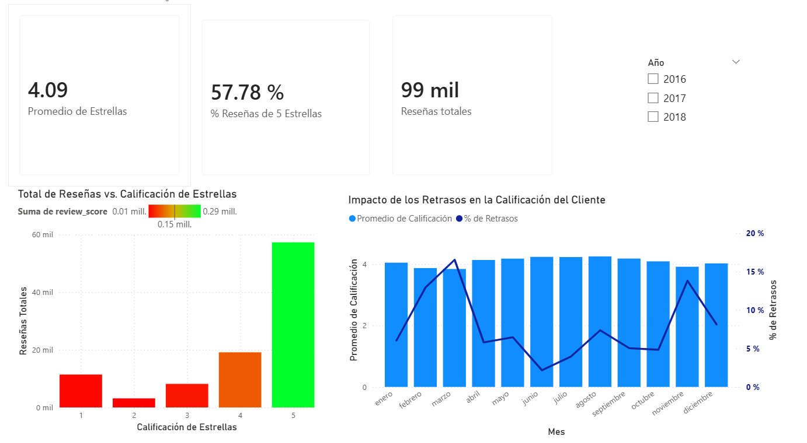

# 📊 E-Commerce Data Pipeline & Business Intelligence System

Este proyecto presenta una solución integral de análisis de datos (End-to-End), abarcando desde la ingesta y procesamiento de datos crudos hasta la generación de tableros de control estratégicos. El objetivo principal es transformar datos operativos de E-Commerce en insights accionables para la toma de decisiones en áreas de Ventas, Finanzas, Logística y Experiencia del Cliente.

## Stack Tecnológico

* **ETL & Procesamiento:** Python (Pandas) en Google Colab para la limpieza, normalización y transformación de datos.
* **Base de Datos (Cloud):** PostgreSQL alojado en **Supabase** para el almacenamiento relacional escalable.
* **Visualización:** Power BI, conectado directamente a Supabase para el modelado de datos y diseño de dashboards.

---

## 📈 Análisis y Visualización de Insights (General)

### 1. Evolución de Ingresos y Ventas
* **Métrica Clave:** **13.59 millones** en ingresos totales con **99 mil** órdenes procesadas.
* **Comportamiento Temporal:** Se observa una tendencia de crecimiento sostenido desde 2016, alcanzando picos superiores a **1.00 mill.** mensuales en 2017.
* **Categorías Top:** El segmento de **Health & Beauty** lidera el ranking de ingresos (~1.3 mill.), seguido de cerca por **Watches & Gifts**.

### 2. Finanzas y Métodos de Pago
* **Preferencia de Pago:** El **78.3%** de los ingresos se generan a través de **Tarjetas de Crédito**, consolidándose como el método principal.
* **Comportamiento de Cuotas:** Existe una concentración masiva en compras de **1 sola cuota**, lo que indica un perfil de consumidor con liquidez inmediata o preferencia por evitar el endeudamiento a largo plazo.
* **Ticket Promedio:** Se mantiene un ticket promedio de **136.66**, permitiendo predecir ingresos en base al volumen de órdenes.
* **Estado con más Pagos:** Se identifica a estado de **SP (São Paulo)**, como el estado donde provienen la mayoria de Ingresos de Olist.

### 3. Eficiencia Logística
* **Desempeño Operativo:** La tasa promedio de retraso es del **7.9%**, con un tiempo de entrega (Delivery) promedio de **12.5 días**.
* **Correlación Volumen-Retraso:** El análisis revela que meses con alta demanda (como marzo) estresan la cadena de suministro, elevando el % de retraso por encima del **15%**.
* **Distribución Geográfica:** El estado de **SP (São Paulo)** domina el volumen de operaciones con más de 41k órdenes, manteniendo una de las tasas de retraso más bajas (5.7%).

### 4. Satisfacción del Cliente (CSAT)
* **Nivel de Servicio:** El promedio general de calificación es de **4.09 estrellas**, con un **57.78%** de reseñas con puntaje máximo (5 estrellas).
* **Impacto de los Retrasos:** Se identifica una correlación inversa directa: en los meses donde la tasa de retraso aumenta (ej. marzo), la calificación promedio de los usuarios tiende a descender, validando que la puntualidad es el factor crítico para la satisfacción.

---

## Arquitectura del Proyecto

1.  **Extract & Transform:** Limpieza de datos nulos, tratamiento de outliers y estandarización de categorías mediante scripts en Python.
2.  **Load:** Carga automatizada a una instancia de PostgreSQL en la nube (Supabase) garantizando la integridad referencial.
3.  **Modelado:** Creación de un esquema de estrella en Power BI, definición de medidas DAX para KPIs complejos y diseño de interfaz de usuario interactiva.

---

## 📂 Estructura del Repositorio

* `/Notebooks`: Código en Python (.ipynb) utilizado para el proceso ETL.
* `/Data`: Diseño de la BD PostgreSQL.
* `/Imagenes`: Capturas de pantalla de los reportes.

---
**Desarrollado por:** Antonio Guanilo
